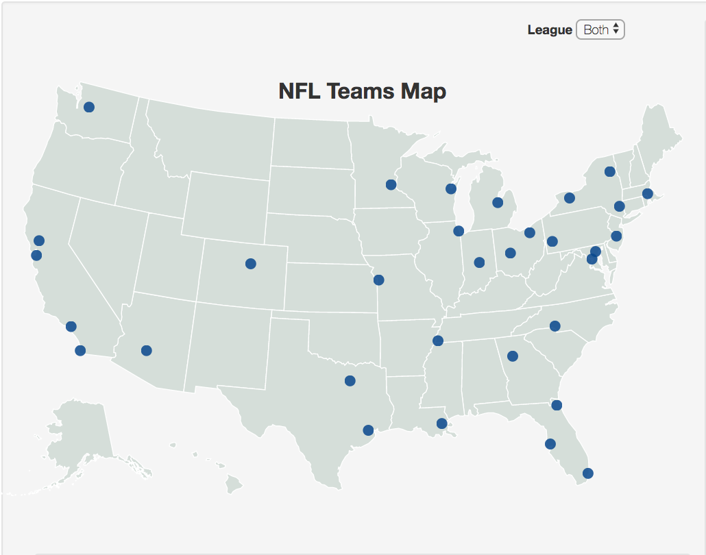
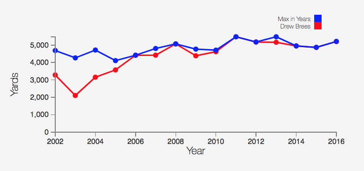
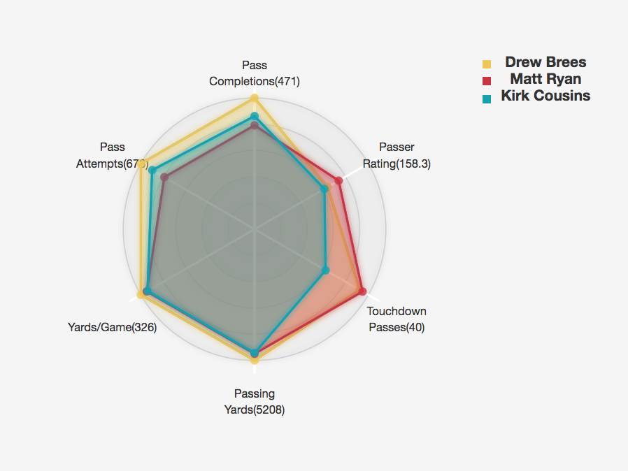

# Football Statistics

This was done as a project to visualize 10 years of NFL data for Information Visualization course. 

[LiveDemo](http://qav2.cs.odu.edu/projects/Infovis/index.html)

### Data Collection
The data for the project is obtained by scraping the ESPN site for all the teams in the last 10 seasons. Getting the data itself is a huge 
task as we should crawl through a lot of pages to get individual player statistics, team stats and the details of each game. BeautifulSoup 
is used to do this.

### Data Refining
Tools like [Open Refine](http://openrefine.org/) were used to clean the obtained data and convert the huge data into small different files. If the data was left as a single file, it would take a lot of time to load the plots which needs just a small information. To overcome this, the data was split into different files, which would make it easier to load different plots. The files can be found in **datasrc** folder.

### Plots used to visualize data

**1. Choropleth map**
This was used to visualize all the 32 teams present in NFL on a US map. Also a cool feature of highlighting the other teams in the same division when we hover on a team dot was implemented. Also the other plots are linked using this map.

**2. Multi-line graph**
This can be used to visualize the players rushing yards/passing yards etc., in a season vs the maximum in that season based on their respective position. This was considered as the best option to visualize a player's performance as comparing a player with the best in the 
season gives the correct idea of how the player performed.

**3. Radar chart**
This chart can be used to compare 4 players at a time baed on several parameters. This was considered the best choice as the parameters are of different type and it's hard to visualize it in a multiline graph.

**Several other plots were used to visualize the data which are on the live site mentioned above.**
